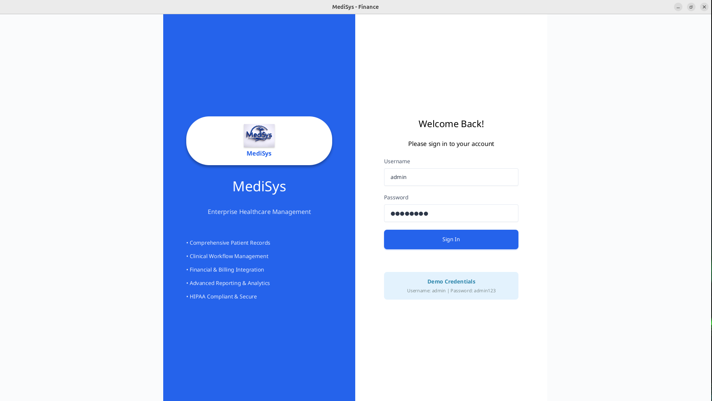
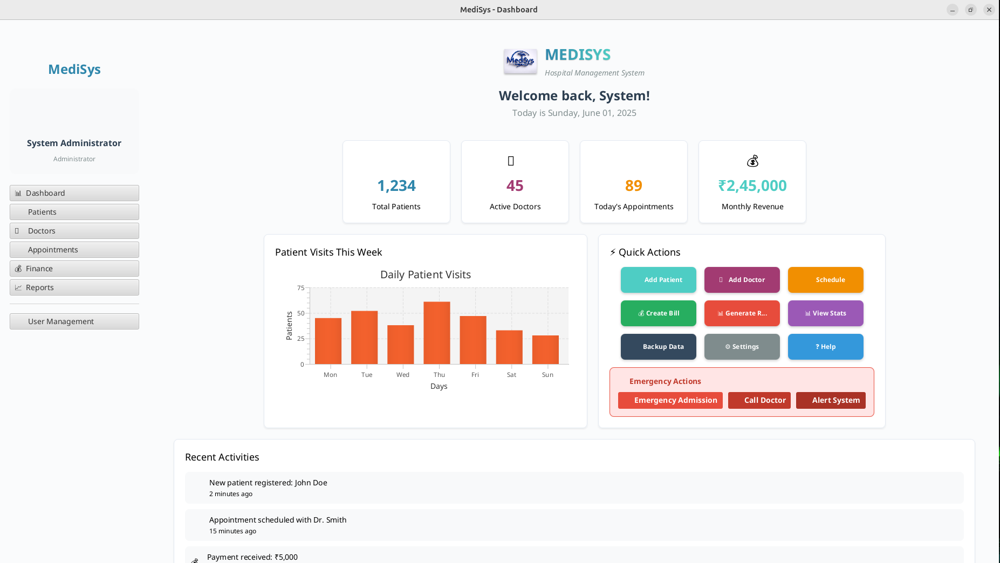
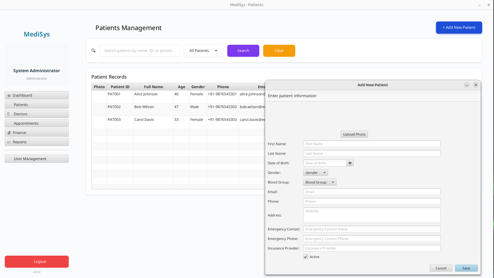
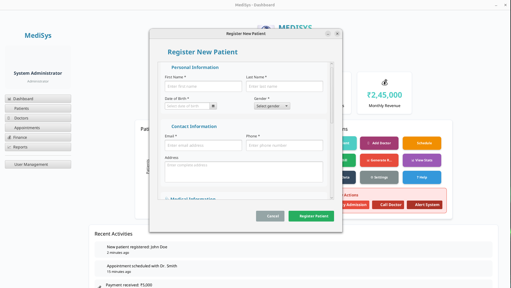
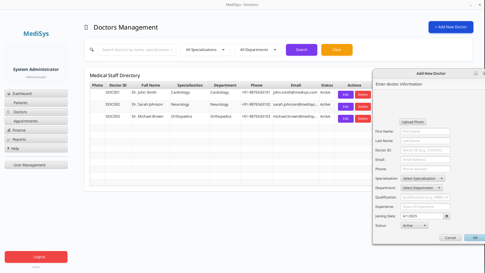
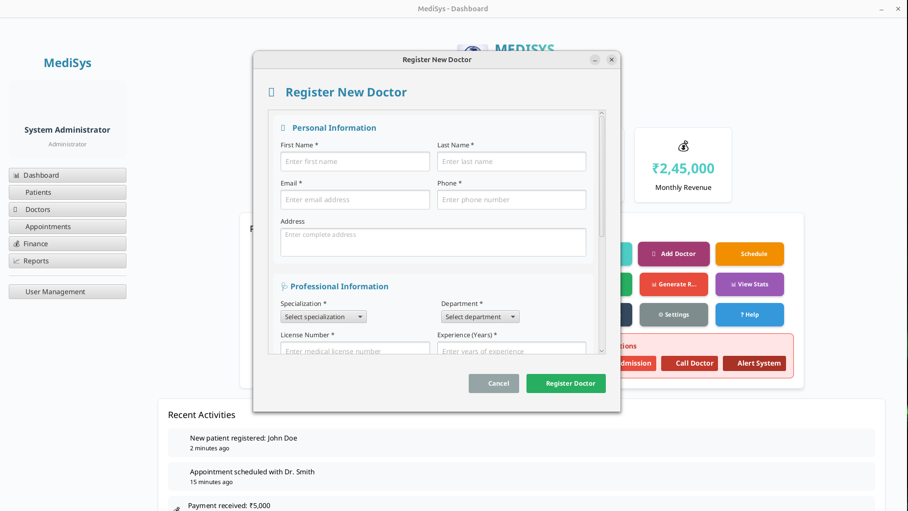
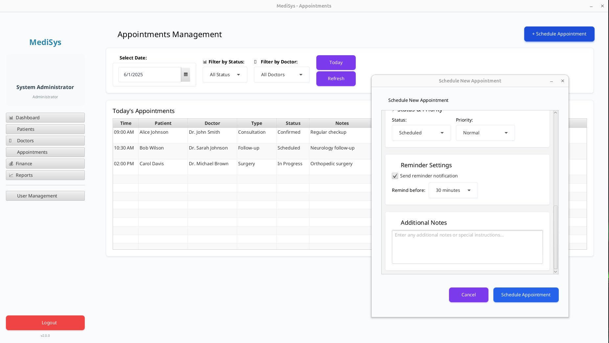
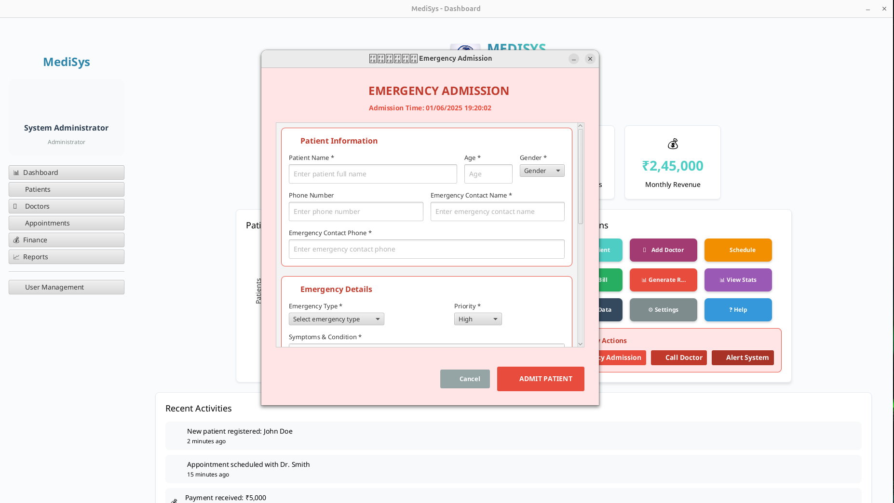
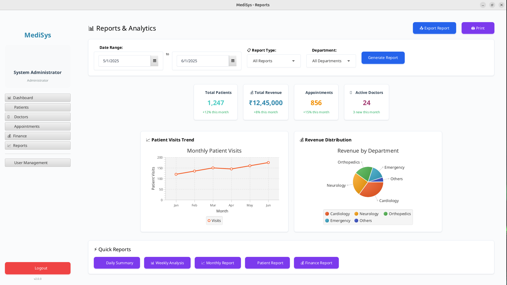

# MediSys - Enterprise Healthcare Management System

[](https://openjdk.java.net/projects/jdk/17/)
[](https://openjfx.io/)
[](https://spring.io/projects/spring-boot)
[](https://www.postgresql.org/)
[]()
[](LICENSE.md)

**MediSys** is a modern, enterprise-grade healthcare management system featuring a vibrant JavaFX desktop application with comprehensive patient management, clinical workflows, and financial operations. Built with professional-grade architecture and designed for healthcare organizations of all sizes.


## 📸 Application Screenshots

### 🔐 Professional Login Interface

*Secure login with vibrant blue background and MediSys branding*

### 🏠 Main Dashboard

*Comprehensive overview with real-time statistics and quick access modules*

### 👥 Patient Management

*Complete patient lifecycle management with search, filtering, and detailed records*

### ➕ New Patient Registration

*Comprehensive patient registration form with photo upload capability*

### 👨‍⚕️ Doctor Management

*Physician profiles, specializations, and department assignments*

### ➕ New Doctor Registration

*Complete doctor registration form with professional information and photo upload*

### 📅 Appointment Scheduling

*Calendar-based appointment management with doctor availability and status tracking*

### � Emergency Admission

*Quick emergency patient admission with priority handling and immediate processing*

### 📊 Reports & Analytics

*Advanced reporting with PDF/CSV export capabilities and comprehensive filtering options*

## 🚀 Currently Implemented Features

### 🎨 **Modern User Interface**
- **Vibrant Enterprise Design**: Professional color palette with vibrant blues, purples, greens, and oranges
- **Consistent Typography**: Uniform font family (Segoe UI/Roboto) across all components
- **Uniform Button Styling**: Standardized button sizes (120px × 42px) with center-aligned text
- **Responsive Layout**: Adaptive interface that works across different screen sizes
- **Professional Branding**: MediSys logo integration with healthcare-appropriate styling

### 🏥 **Core Healthcare Management**
- **Patient Management**:
  - Complete patient registration and profile management
  - Patient search and filtering capabilities
  - Medical history tracking and documentation
  - Patient photo upload and management
  - Comprehensive patient data forms with validation

- **Doctor Management**:
  - Physician profile creation and management
  - Specialization and department assignment
  - Doctor photo upload and management
  - Professional credentials tracking
  - Workload and schedule management

- **Department Management**:
  - Hospital department creation and organization
  - Department head assignment and management
  - Resource allocation and tracking
  - Department-specific configurations
  - Staff assignment and management

### 📅 **Appointment System**
- **Appointment Scheduling**:
  - Calendar-based appointment booking
  - Doctor availability management
  - Patient appointment history
  - Appointment status tracking (Scheduled, Completed, Cancelled)
  - Time slot management and conflict prevention

### 💰 **Financial Operations**
- **Billing Management**:
  - Patient billing and invoice generation
  - Payment processing and tracking
  - Insurance claim management
  - Financial transaction history
  - Payment status monitoring

### 📊 **Reporting & Analytics**
- **Comprehensive Reports**:
  - Patient reports with filtering options
  - Doctor performance reports
  - Department-wise analytics
  - Financial reports and summaries
  - Custom date range filtering

- **Export Capabilities**:
  - PDF report generation with watermarked logos
  - CSV export for data analysis
  - All reports and department-wise exports
  - Professional report formatting

### 🔐 **Security & Authentication**
- **Role-Based Access Control**:
  - Admin, Doctor, Finance, and Department Head roles
  - Secure login with username/password authentication
  - Session management and user state tracking
  - Access control for different modules based on user roles

### 🛠 **Technical Features**
- **Database Integration**:
  - PostgreSQL database with comprehensive schema
  - Sample data generation for testing and demonstration
  - Data persistence and transaction management
  - Optimized queries for performance

- **Modern Architecture**:
  - JavaFX 22 for rich desktop UI
  - Spring Boot 3.3.0 backend integration
  - Maven build system with dependency management
  - Modular code structure for maintainability

## 🏗️ Architecture Overview

### **System Architecture**
```
┌─────────────────┐    ┌─────────────────┐    ┌─────────────────┐
│   JavaFX GUI    │    │  Spring Boot    │    │   PostgreSQL    │
│   Controllers   │◄──►│   Services      │◄──►│   Database      │
└─────────────────┘    └─────────────────┘    └─────────────────┘
         │                       │                       │
         │              ┌─────────────────┐              │
         │              │  Redis Cache    │              │
         └──────────────┤   Layer         ├──────────────┘
                        └─────────────────┘
                                 │
                        ┌─────────────────┐
                        │  Monitoring &   │
                        │  Metrics        │
                        └─────────────────┘
```

### **Technology Stack**
- **Frontend**: JavaFX 22 with FXML and CSS
- **Backend**: Spring Boot 3.3.0 with Spring Security
- **Database**: PostgreSQL 16.9 with HikariCP connection pooling
- **Caching**: Redis 7.0 with Spring Cache abstraction
- **Monitoring**: Micrometer with Prometheus metrics
- **Testing**: JUnit 5, Mockito, Testcontainers
- **Build**: Maven 3.9+ with multi-module support

## 🏥 Module Details

### 🏠 **Main Dashboard**
- **System Overview**: Real-time statistics and key performance indicators
- **Quick Access Modules**: Direct navigation to all major system components
- **User Session Management**: Current user information and role-based access
- **Statistics Cards**: Patient count, doctor count, appointment metrics, and financial summaries
- **Professional Layout**: Clean, organized interface with vibrant enterprise styling

### 👥 **Patients Module**
- **Patient Registration**: Comprehensive patient onboarding with detailed forms
- **Patient Search & Filter**: Advanced search capabilities with multiple criteria
- **Medical Records**: Complete patient history and medical documentation
- **Photo Management**: Patient photo upload with placeholder image support
- **Data Validation**: Form validation to ensure data integrity and completeness
- **CRUD Operations**: Full create, read, update, delete functionality for patient records

### 👨‍⚕️ **Doctors Module**
- **Doctor Profiles**: Detailed physician information and credentials management
- **Specialization Tracking**: Medical specialties and areas of expertise
- **Department Assignment**: Link doctors to specific hospital departments
- **Photo Management**: Professional headshot upload and management
- **Schedule Management**: Doctor availability and working hours
- **Performance Metrics**: Track doctor workload and patient assignments

### 🏥 **Departments Module**
- **Department Creation**: Establish and organize hospital departments
- **Resource Management**: Track department resources, equipment, and facilities
- **Staff Assignment**: Assign doctors and staff to specific departments
- **Department Head Management**: Designate and manage department leadership
- **Configuration Settings**: Department-specific settings and operational parameters

### 📅 **Appointments Module**
- **Appointment Scheduling**: Calendar-based booking system with time slot management
- **Doctor Availability**: Real-time availability checking and conflict prevention
- **Patient History**: Complete appointment history for each patient
- **Status Tracking**: Monitor appointment status (Scheduled, Completed, Cancelled, No-Show)
- **Filtering & Search**: Advanced filtering by date, doctor, patient, or status
- **Appointment Management**: Modify, reschedule, or cancel existing appointments

### 💰 **Finance Module**
- **Billing System**: Generate and manage patient bills and invoices
- **Payment Processing**: Track payments, outstanding balances, and payment methods
- **Insurance Management**: Handle insurance claims and coverage verification
- **Financial Reporting**: Comprehensive financial analytics and reporting
- **Transaction History**: Complete audit trail of all financial transactions
- **Revenue Tracking**: Monitor hospital revenue streams and financial performance

### 📊 **Reports Module**
- **Dynamic Report Generation**: Create custom reports based on various criteria
- **Multi-Format Export**: Export reports in PDF and CSV formats
- **Date Range Filtering**: Flexible date-based filtering for historical analysis
- **Department-Wise Reports**: Generate reports specific to individual departments
- **Watermarked PDFs**: Professional PDF reports with MediSys branding
- **Data Analytics**: Comprehensive data analysis and visualization capabilities

## 🛠️ Installation & Setup

### Prerequisites
- **Java 17+** (OpenJDK or Oracle JDK)
- **Maven 3.9+** for build management
- **PostgreSQL 16.9+** for database
- **Redis 7.0+** for caching (optional but recommended)
- **Git** for version control

### Quick Installation

1. **Clone the Repository**
```bash
git clone https://github.com/your-org/medisys.git
cd medisys
```

2. **Database Setup**
```bash
# Create PostgreSQL database
sudo -u postgres createdb medisys

# Create user and grant permissions
sudo -u postgres psql -c "CREATE USER medisys_user WITH PASSWORD 'your_password';"
sudo -u postgres psql -c "GRANT ALL PRIVILEGES ON DATABASE medisys TO medisys_user;"
```

3. **Redis Setup (Optional)**
```bash
# Install and start Redis
sudo apt-get install redis-server
sudo systemctl start redis-server
sudo systemctl enable redis-server
```

4. **Application Configuration**
```bash
# Update database configuration in application.properties
spring.datasource.url=jdbc:postgresql://localhost:5432/medisys
spring.datasource.username=medisys_user
spring.datasource.password=your_password

# Redis configuration (optional)
spring.redis.host=localhost
spring.redis.port=6379
```

5. **Build and Run**
```bash
# Compile the application
mvn clean compile

# Run the application
mvn javafx:run
```

### Docker Installation (Recommended for Production)

1. **Using Docker Compose**
```bash
# Clone and navigate to project
git clone https://github.com/your-org/medisys.git
cd medisys

# Start all services
docker-compose up -d

# View logs
docker-compose logs -f medisys-app
```

2. **Manual Docker Setup**
```bash
# Build the application image
docker build -t medisys:latest .

# Run PostgreSQL
docker run -d --name medisys-db \
  -e POSTGRES_DB=medisys \
  -e POSTGRES_USER=medisys_user \
  -e POSTGRES_PASSWORD=your_password \
  -p 5432:5432 postgres:16.9

# Run Redis
docker run -d --name medisys-redis \
  -p 6379:6379 redis:7.0

# Run MediSys
docker run -d --name medisys-app \
  --link medisys-db:postgres \
  --link medisys-redis:redis \
  -p 8080:8080 medisys:latest
```

## 🔐 Default Login Credentials

### System Administrator
- **Username**: `admin`
- **Password**: `admin123`
- **Role**: System Administrator
- **Access**: Full system access to all modules and administrative functions

### Healthcare Staff
- **Doctor Account**:
  - **Username**: `doctor`
  - **Password**: `admin123`
  - **Role**: Medical Doctor
  - **Access**: Patient management, appointments, medical records

- **Finance Account**:
  - **Username**: `finance`
  - **Password**: `admin123`
  - **Role**: Finance Manager
  - **Access**: Billing, payments, financial reports, revenue management

### Quick Start
1. Launch the application with `mvn javafx:run`
2. Use any of the above credentials to log in
3. Explore the different modules based on your role
4. Sample data is automatically loaded for demonstration purposes

## 🛠 Technical Implementation

### Current Technology Stack
- **JavaFX 22**: Modern desktop UI framework with rich controls
- **Spring Boot 3.3.0**: Enterprise application framework
- **PostgreSQL 16.9**: Primary database with comprehensive schema
- **Maven 3.9+**: Build automation and dependency management

### UI/UX Features
- **Vibrant Enterprise Design**: Professional color palette with modern styling
- **Consistent Typography**: Segoe UI/Roboto font family across all components
- **Uniform Button System**: Standardized sizing (120px × 42px) with center-aligned text
- **Professional Forms**: Consistent form styling with proper validation
- **Action Buttons**: Readable 12px font size with proper spacing (60px × 28px)
- **Responsive Layout**: Adaptive interface for different screen sizes

### Architecture Highlights
- **Modular Design**: Separate modules for Patients, Doctors, Appointments, Finance, Reports
- **Role-Based Access**: Different interfaces based on user permissions
- **Data Validation**: Comprehensive form validation and error handling
- **Professional Styling**: Enterprise-grade visual design system
- **Sample Data Integration**: Pre-loaded demonstration data for immediate testing

### Key Improvements Implemented
- ✅ **Fixed Action Button Font Size**: Increased from 10px to 12px for better readability
- ✅ **Implemented Add Doctor Form**: Complete form with personal and professional information
- ✅ **Consistent Form Styling**: Uniform styling across all add/edit forms
- ✅ **Typography Standardization**: Same font family across entire application
- ✅ **Vibrant Color Palette**: Enterprise-level colors with professional appearance
- ✅ **Button Uniformity**: All buttons have consistent sizing and center-aligned text

## 🧪 Testing

### Running Tests
```bash
# Run all tests
mvn test

# Run specific test class
mvn test -Dtest=CachedPatientServiceTest

# Run tests with coverage
mvn test jacoco:report

# View coverage report
open target/site/jacoco/index.html
```

### Test Categories
- **Unit Tests**: Service layer and business logic testing
- **Integration Tests**: Database and cache integration testing
- **Security Tests**: Authentication and authorization testing
- **Performance Tests**: Load and stress testing

## 📊 Monitoring & Health Checks

### Health Endpoints
- **Application Health**: `http://localhost:8080/actuator/health`
- **Database Health**: `http://localhost:8080/actuator/health/db`
- **Cache Health**: `http://localhost:8080/actuator/health/redis`
- **Metrics**: `http://localhost:8080/actuator/metrics`

### Prometheus Metrics
```bash
# Application metrics
curl http://localhost:8080/actuator/prometheus

# Key metrics to monitor:
# - database_operations_total
# - cache_operations_total
# - application_errors_total
# - user_actions_total
# - active_sessions
```

## 🚀 Production Deployment

### Environment Configuration
```properties
# Production application.properties
spring.profiles.active=production
spring.datasource.url=jdbc:postgresql://prod-db:5432/medisys
spring.redis.host=prod-redis
logging.level.com.medisys=INFO
management.endpoints.web.exposure.include=health,metrics,prometheus
```

### Performance Tuning
```properties
# JVM Options for production
-Xms2g -Xmx4g
-XX:+UseG1GC
-XX:MaxGCPauseMillis=200
-XX:+HeapDumpOnOutOfMemoryError

# HikariCP Configuration
spring.datasource.hikari.maximum-pool-size=20
spring.datasource.hikari.minimum-idle=5
spring.datasource.hikari.connection-timeout=30000
```

## 🔧 Development

### Code Style
- **Java**: Google Java Style Guide
- **Testing**: JUnit 5 with Mockito
- **Documentation**: Javadoc for all public APIs
- **Git**: Conventional Commits

### Building from Source
```bash
# Development build
mvn clean compile

# Production build
mvn clean package -Pproduction

# Create distribution
mvn clean package assembly:single
```

## 📈 Performance Benchmarks

### System Requirements
- **Minimum**: 2GB RAM, 2 CPU cores, 10GB storage
- **Recommended**: 4GB RAM, 4 CPU cores, 50GB storage
- **Production**: 8GB RAM, 8 CPU cores, 100GB storage

### Performance Metrics
- **Startup Time**: < 30 seconds
- **Response Time**: < 200ms (95th percentile)
- **Throughput**: 1000+ requests/minute
- **Memory Usage**: < 2GB under normal load

## 📚 Documentation

### 📖 Comprehensive Documentation
- **[📋 Contributing Guide](CONTRIBUTING.md)** - Complete contribution guidelines and development setup
- **[🏠 Wiki Home](docs/wiki/Home.md)** - Central hub for all documentation
- **[🚀 Installation Guide](docs/wiki/Installation-Guide.md)** - Detailed installation instructions
- **[👤 User Manual](docs/wiki/User-Manual.md)** - Complete user documentation
- **[💻 Developer Guide](docs/wiki/Developer-Guide.md)** - Development setup and guidelines
- **[❓ FAQ](docs/wiki/FAQ.md)** - Frequently asked questions

### 🔗 Quick Links
- **[System Requirements](docs/wiki/Installation-Guide.md#prerequisites)** - Hardware and software requirements
- **[Quick Start](docs/wiki/Installation-Guide.md#quick-installation)** - Get up and running in 5 minutes
- **[User Roles & Permissions](docs/wiki/User-Manual.md#user-management)** - Access control documentation
- **[API Documentation](docs/wiki/Developer-Guide.md#api-development)** - Service interfaces and APIs
- **[Troubleshooting](docs/wiki/FAQ.md#technical-issues)** - Common issues and solutions

## 🤝 Contributing

We welcome contributions from developers, healthcare professionals, and users! Please see our comprehensive documentation for getting started:

### 📋 How to Contribute
1. **Read** the [Contributing Guide](CONTRIBUTING.md) for detailed guidelines
2. **Check** existing [issues](https://github.com/Mazharuddin-Mohammed/MediSysJava/issues) and [discussions](https://github.com/Mazharuddin-Mohammed/MediSysJava/discussions)
3. **Follow** our [Developer Guide](docs/wiki/Developer-Guide.md) for development setup
4. **Review** our [Code of Conduct](CONTRIBUTING.md#code-of-conduct)

### 🛠️ Development Workflow
1. **Fork** the repository on GitHub
2. **Clone** your fork locally
3. **Create** a feature branch (`git checkout -b feature/amazing-feature`)
4. **Make** your changes following our [coding standards](docs/wiki/Developer-Guide.md#coding-standards)
5. **Add** tests for new functionality
6. **Ensure** all tests pass (`mvn test`)
7. **Commit** your changes (`git commit -m 'feat: add amazing feature'`)
8. **Push** to your branch (`git push origin feature/amazing-feature`)
9. **Submit** a pull request

### 🎯 Contribution Areas
- **🐛 Bug Fixes**: Fix existing functionality issues
- **✨ New Features**: Patient management, scheduling, reporting enhancements
- **📚 Documentation**: User guides, API docs, tutorials
- **🧪 Testing**: Unit tests, integration tests, UI tests
- **🎨 UI/UX**: Interface improvements and accessibility
- **🔧 Performance**: Optimization and scalability improvements

### 👥 Community
- **💬 Discussions**: [GitHub Discussions](https://github.com/Mazharuddin-Mohammed/MediSysJava/discussions)
- **🐛 Issues**: [Report Bugs](https://github.com/Mazharuddin-Mohammed/MediSysJava/issues)
- **📧 Email**: mazharuddin.mohammed.official@fmail.com
- **📱 Phone**: +91-9347607780

## 📄 License

This project is licensed under the MIT License - see the [LICENSE](LICENSE) file for details.

## 🆘 Support & Contact

### 👨‍💻 Developer Contact
- **Developer**: Dr. Mazharuddin Mohammed
- **Email**: mazharuddin.mohammed.official@fmail.com
- **Phone**: +91-9347607780
- **Location**: Hyderabad, India
- **GitHub**: [www.github.com/Mazharuddin-Mohammed](https://www.github.com/Mazharuddin-Mohammed)
- **LinkedIn**: [www.linkedin.com/in/mazharuddin-mohammed](https://www.linkedin.com/in/mazharuddin-mohammed)

### 🔧 Technical Support
Available for:
- Technical Support & Bug Reports
- Feature Requests & Enhancements
- Custom Development Projects
- Healthcare Software Solutions
- System Integration & Deployment

**Response Time**: Within 24 hours

### 📚 Documentation & Resources
- **Documentation**: [Wiki](https://github.com/your-org/medisys/wiki)
- **Issues**: [GitHub Issues](https://github.com/your-org/medisys/issues)
- **Discussions**: [GitHub Discussions](https://github.com/your-org/medisys/discussions)

## 🏆 Acknowledgments

- Spring Boot team for the excellent framework
- JavaFX community for UI components
- PostgreSQL team for the robust database
- Redis team for high-performance caching
- All contributors who helped make this project better

---

**MediSys** - Transforming Healthcare Management with Modern Technology