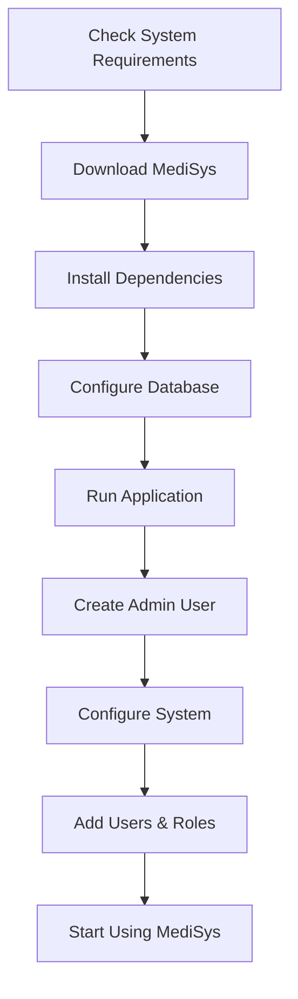

# MediSys Hospital Management System - Wiki

Welcome to the comprehensive documentation wiki for MediSys Hospital Management System! This wiki provides detailed information about installation, configuration, usage, and development.

## 📚 Wiki Navigation

### 🚀 Getting Started
- **[Installation Guide](Installation-Guide.md)** - Complete setup instructions
- **[Quick Start](Quick-Start.md)** - Get up and running in 5 minutes
- **[System Requirements](System-Requirements.md)** - Hardware and software requirements
- **[Configuration](Configuration.md)** - System configuration options

### 👥 User Guides
- **[User Manual](User-Manual.md)** - Complete user documentation
- **[Patient Management](Patient-Management.md)** - Managing patient records
- **[Doctor Management](Doctor-Management.md)** - Doctor profiles and scheduling
- **[Appointment System](Appointment-System.md)** - Scheduling and management
- **[Financial Management](Financial-Management.md)** - Billing and payments
- **[Reports & Analytics](Reports-Analytics.md)** - Generating and exporting reports

### 🔧 Administration
- **[Admin Guide](Admin-Guide.md)** - System administration
- **[User Roles & Permissions](User-Roles-Permissions.md)** - Access control
- **[Database Management](Database-Management.md)** - Database operations
- **[Backup & Recovery](Backup-Recovery.md)** - Data protection
- **[Security Configuration](Security-Configuration.md)** - Security settings

### 💻 Development
- **[Developer Guide](Developer-Guide.md)** - Development setup and guidelines
- **[API Documentation](API-Documentation.md)** - Service interfaces and APIs
- **[Architecture Overview](Architecture-Overview.md)** - System architecture
- **[Code Style Guide](Code-Style-Guide.md)** - Coding standards
- **[Testing Guide](Testing-Guide.md)** - Testing strategies and tools

### 🔌 Integration
- **[Database Integration](Database-Integration.md)** - Database connectivity
- **[External APIs](External-APIs.md)** - Third-party integrations
- **[Import/Export](Import-Export.md)** - Data import and export
- **[Plugins & Extensions](Plugins-Extensions.md)** - Extending functionality

### 🛠️ Troubleshooting
- **[Common Issues](Common-Issues.md)** - Frequently encountered problems
- **[Error Messages](Error-Messages.md)** - Error codes and solutions
- **[Performance Tuning](Performance-Tuning.md)** - Optimization tips
- **[Debugging Guide](Debugging-Guide.md)** - Debugging techniques

### 📋 Reference
- **[Feature List](Feature-List.md)** - Complete feature overview
- **[Keyboard Shortcuts](Keyboard-Shortcuts.md)** - Productivity shortcuts
- **[File Formats](File-Formats.md)** - Supported file formats
- **[Glossary](Glossary.md)** - Terms and definitions

## 🎯 Quick Links

### For New Users
1. **[System Requirements](System-Requirements.md)** - Check compatibility
2. **[Installation Guide](Installation-Guide.md)** - Install MediSys
3. **[Quick Start](Quick-Start.md)** - First-time setup
4. **[User Manual](User-Manual.md)** - Learn the basics

### For Administrators
1. **[Admin Guide](Admin-Guide.md)** - Administrative tasks
2. **[User Roles & Permissions](User-Roles-Permissions.md)** - Set up access control
3. **[Database Management](Database-Management.md)** - Manage data
4. **[Backup & Recovery](Backup-Recovery.md)** - Protect your data

### For Developers
1. **[Developer Guide](Developer-Guide.md)** - Development environment
2. **[Architecture Overview](Architecture-Overview.md)** - Understand the system
3. **[API Documentation](API-Documentation.md)** - Service interfaces
4. **[Testing Guide](Testing-Guide.md)** - Quality assurance

## 🆘 Need Help?

### Support Channels
- **📧 Email**: mazharuddin.mohammed.official@fmail.com
- **🐛 Issues**: [GitHub Issues](https://github.com/Mazharuddin-Mohammed/MediSysJava/issues)
- **💬 Discussions**: [GitHub Discussions](https://github.com/Mazharuddin-Mohammed/MediSysJava/discussions)
- **📱 Phone**: +91-9347607780

### Community Resources
- **[Contributing Guide](../../CONTRIBUTING.md)** - How to contribute
- **[Code of Conduct](Code-of-Conduct.md)** - Community guidelines
- **[FAQ](FAQ.md)** - Frequently asked questions
- **[Release Notes](Release-Notes.md)** - Version history

## 📊 System Overview

### Key Features
- **👥 Patient Management** - Complete patient record system
- **👨‍⚕️ Doctor Management** - Doctor profiles and specializations
- **📅 Appointment Scheduling** - Advanced scheduling system
- **💰 Financial Management** - Billing and payment tracking
- **📊 Reports & Analytics** - Comprehensive reporting
- **🔐 Security** - Role-based access control
- **📱 Modern UI** - Intuitive JavaFX interface
- **🗄️ Database** - H2/PostgreSQL support

### Technology Stack
- **Frontend**: JavaFX 22+ with FXML and CSS
- **Backend**: Java 17+ with Maven
- **Database**: H2 (embedded) / PostgreSQL (production)
- **Reporting**: Apache PDFBox for PDF generation
- **Architecture**: MVC pattern with service layer

## 🔄 Recent Updates

### Version 1.0.0 (Latest)
- ✅ Complete patient management system
- ✅ Doctor registration and profiles
- ✅ Appointment scheduling with calendar
- ✅ Financial management and billing
- ✅ PDF report generation with image embedding
- ✅ Modern enterprise-grade UI
- ✅ Role-based access control
- ✅ Comprehensive help system

### Upcoming Features
- 🔄 Mobile app integration
- 🔄 Cloud deployment support
- 🔄 Advanced analytics dashboard
- 🔄 Telemedicine integration
- 🔄 Multi-language support

## 📈 Getting Started Workflow

## 🏆 Success Stories

> "MediSys has transformed our hospital's patient management process. The intuitive interface and comprehensive features have improved our efficiency by 40%."
> 
> *- Dr. Sarah Johnson, Chief Medical Officer*

> "The reporting capabilities are outstanding. We can generate detailed analytics in minutes instead of hours."
> 
> *- Michael Chen, Hospital Administrator*

---

## 📞 Contact Information

**Developer**: Dr. Mazharuddin Mohammed  
**Email**: mazharuddin.mohammed.official@fmail.com  
**Phone**: +91-9347607780  
**Location**: Hyderabad, India  
**GitHub**: [Mazharuddin-Mohammed](https://github.com/Mazharuddin-Mohammed)  
**LinkedIn**: [Dr. Mazharuddin Mohammed](https://www.linkedin.com/in/mazharuddin-mohammed)

---

*Last updated: June 2025 | Version 1.0.0*
